  

   

  

    

  

    🎓 <strong>Licence Pro. Métiers de l'Internet - Application Web (3rd Year)</strong>. 
    I craft <strong>Backend architectures</strong> (<strong>PHP / Symfony</strong>) with a solid Frontend touch, bridging logic and UX. 
    🛠️ <strong>Maker at heart :</strong> Deep into PC hardware for years, running a self-hosted <strong>HomeLab</strong>, automating workflows with Python. 
    🔍 <strong>Curious by nature</strong> — from scripting bots to encoding videos, I tinker with anything that involves code or creative workflows. 
    🌍 Fluent in <strong>French</strong> (Native), <strong>English</strong> (B2) — Code speaks louder anyway.
  

  
  

 

### 🧱 Technical Stack

**Backend & Architecture (My Core)**

  
  
  
  
  
  

**Frontend Ecosystem**

  
  
  
  
  
  

**HomeLab & Automation**
*Where I merge Dev, SysAdmin & Hardware tinkering*

  
  
  
  
  

**Creative Tech & Side Projects**
*Where curiosity meets code — I explore everything from game bots to media workflows*

  
  
  

 

### Dev Journey & Experience

| Year | Role & Context | Key Skills Developed |
| :--- | :--- | :--- |
| **2025 - 2026** *(LP3 Studies)* | **Advanced Fullstack Engineering** Building production-grade architectures : custom frameworks, Design Patterns, Symfony mastery & MEAN stack. | `PHP 8 OOP` `Design Patterns` `Symfony Advanced` `MEAN Stack` `Agile/Scrum` `Security` |
| **2025** *(Internship)* | **AI & Industrial Data @ Prosyst** Optimized massive datasets for predictive maintenance pipelines. | `Big Data` `SQL Optimization` `AI/ML` `Data Processing` |
| **2024 - 2025** *(LP2 Studies)* | **Dynamic Web & DevOps Foundations** Transitioned from static to dynamic : PHP/MySQL, JS libraries, server administration & CI/CD basics. | `PHP` `MySQL` `JavaScript` `Server Admin` `Web Security` `Project Management` |
| **2023 - 2024** *(LP1 Studies)* | **Web Fundamentals** Algorithmic thinking, CMS ecosystems (WordPress), databases introduction & frontend basics. | `Algorithms` `SQL Basics` `WordPress` `JavaScript Intro` `UX Fundamentals` |

 

### Philosophy

> **"If it can be automated, it should be. If it can be optimized, it will be."**  
> *— My approach to code*

> **"Music is the answer to problems that can't be solved."**  
> *— My approach to life (Electro & 80s vibes 🎧)*

 

### GitHub Stats

  
  
  

 

  

