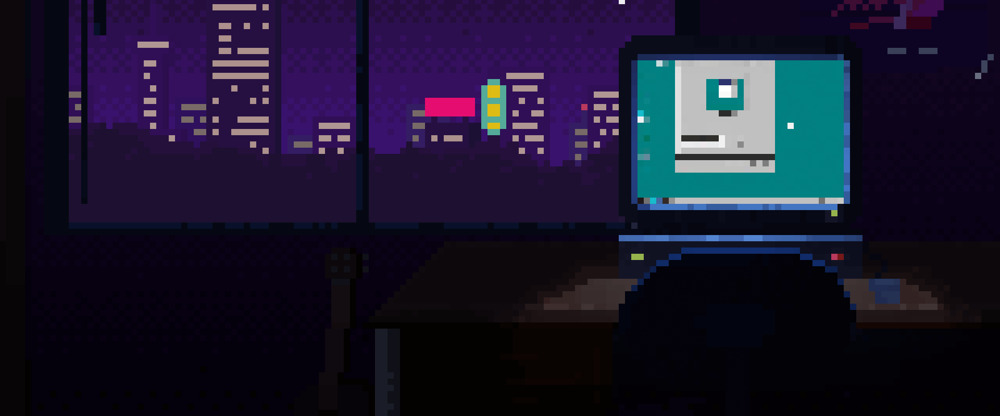

  

   

  

    

  

    I craft <strong>Backend architectures</strong> (<strong>PHP / Symfony</strong>) with a solid Frontend touch, bridging logic and UX. 
    🛠️ <strong>Maker at heart :</strong> Deep into PC hardware for years, running a self-hosted <strong>HomeLab</strong>, automating workflows with Python. 
    🔍 <strong>Curious by nature</strong> — from scripting bots to encoding videos, I tinker with anything that involves code or creative workflows. 
    🌍 Fluent in <strong>French</strong> (Native), <strong>English</strong> (B2) — Code speaks louder anyway.
  

  
  

 

### 🧱 Technical Stack

**Backend & Architecture (My Core)**

  
  
  
  
  
  

 

**Frontend Ecosystem**

  
  
  
  
  
  

 

**HomeLab & Automation**
*Where I merge Dev, SysAdmin & Hardware tinkering*

  
  
  
  
  

 

**Creative Tech & Side Projects**
*Where curiosity meets code — I explore everything from game bots to media workflows*

  
  
  

 

### GitHub Stats

  
  
  

 

  

 

### Featured Projects

  
  
  
  

 

  

